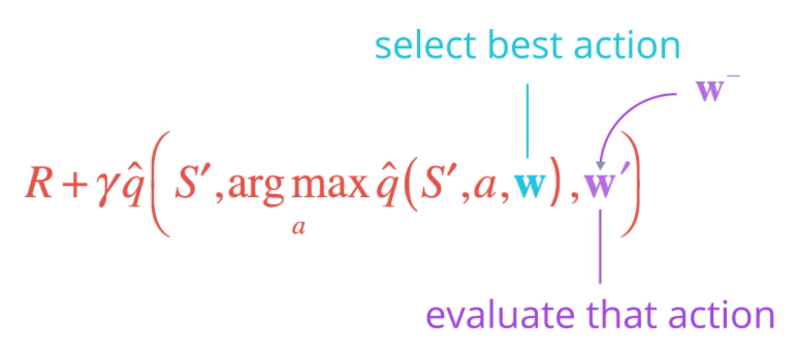
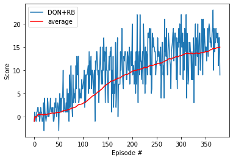
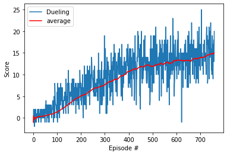
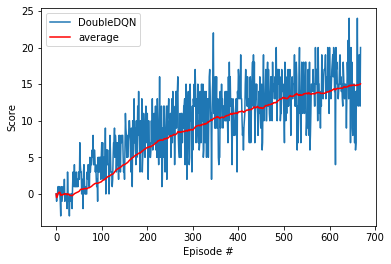
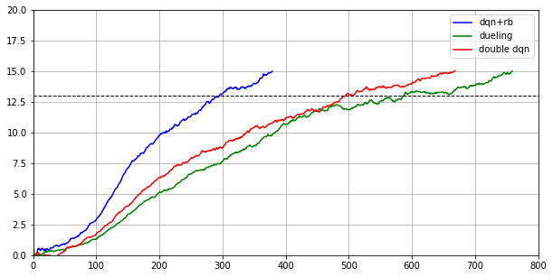

### Project 1: Navigation
# Train an RL Agent to Collect Bananas


##### &nbsp;

## Goal
To build a reinforcement learning (RL) agent that navigates an environment that is similar to [Unity's Banana Collector environment](https://github.com/Unity-Technologies/ml-agents/blob/master/docs/Learning-Environment-Examples.md#banana-collector).

A reward of +1 is provided for collecting a yellow banana, and a reward of -1 is provided for collecting a blue banana. The goal of our agent is to collect as many yellow bananas as possible while avoiding blue bananas. In order to solve the environment, our agent must achieve an average score of +13 over 100 consecutive episodes.


## Approach
Here are the high-level steps taken in building an agent that solves this environment.

1. Evaluate the state and action space.
1. Establish baseline using a random action policy.
1. Implement learning algorithm.
1. Run experiments to measure agent performance.
1. Select best performing agent and capture video of it navigating the environment.

##### &nbsp;

### 1. Evaluate State & Action Space
The state space has 37 dimensions and contains the agent's velocity, along with ray-based perception of objects around the agent's forward direction. Given this information, the agent has to learn how to best select actions. Four discrete actions are available:

- `0` move forward
- `1` move backward
- `2` turn left
- `3` turn right


##### &nbsp;

### 2. Establish Baseline
Before building an agent that learns, I started by testing an agent that selects actions (uniformly) at random at each time step.

```python
env_info = env.reset(train_mode=False)[brain_name] # reset the environment
state = env_info.vector_observations[0]            # get the current state
score = 0                                          # initialize the score
while True:
    action = np.random.randint(action_size)        # select an action
    env_info = env.step(action)[brain_name]        # send the action to the environment
    next_state = env_info.vector_observations[0]   # get the next state
    reward = env_info.rewards[0]                   # get the reward
    done = env_info.local_done[0]                  # see if episode has finished
    score += reward                                # update the score
    state = next_state                             # roll over the state to next time step
    if done:                                       # exit loop if episode finished
        break

print("Score: {}".format(score))
```

Running this agent a few times resulted in scores from -2 to 2. Obviously, if the agent needs to achieve an average score of 13 over 100 consecutive episodes, then choosing actions at random won't work.


##### &nbsp;

### 3. Implement Learning Algorithm
Agents use a policy to decide which actions to take within an environment. The primary objective of the learning algorithm is to find an optimal policy&mdash;i.e., a policy that maximizes the reward for the agent. Since the effects of possible actions aren't known in advance, the optimal policy must be discovered by interacting with the environment and recording observations. Thus, the agent "learns" the policy through a process of trial-and-error that iteratively maps various environment states to the actions that yield the highest reward. This type of algorithm is called **Q-Learning**.

For constructing the Q-Learning algorithm, the approach here is to implement a set of different components, run tests to determine the best combination of components and hyperparameters to achieve the best results.


#### Q-Function
To discover an optimal policy, I setup a Q-function. The Q-function calculates the expected reward `R` for all possible actions `A` in all possible states `S`.


We can then define our optimal policy `π*` as the action that maximizes the Q-function for a given state across all possible states. The optimal Q-function `Q*(s,a)` maximizes the total expected reward for an agent starting in state `s` and choosing action `a`, then following the optimal policy for each subsequent state.

#### Deep Q-Network (DQN)
With Deep Q-Learning, a deep neural network is used to approximate the Q-function. Given a network `F`, finding an optimal policy is a matter of finding the best weights `w` such that `F(s,a,w) ≈ Q(s,a)`.

The neural network architecture used for this project can be found [here](https://github.com/epoc88/DeepReinforcementLearning_Navigation/blob/master/model.py) in the `model.py` file of the source code. The network contains three fully connected layers with 64, 64, and 4 nodes respectively. Testing of bigger networks (more nodes) and deeper networks (more layers) did not produce better results.

As for the network inputs, rather than feeding-in sequential batches of experience tuples, I randomly sample from a history of experiences using an approach called Experience Replay.


#### Double Deep Q-Network (DDQN)
One issue with Deep Q-Networks is they can overestimate Q-values (see [Thrun & Schwartz, 1993](https://www.ri.cmu.edu/pub_files/pub1/thrun_sebastian_1993_1/thrun_sebastian_1993_1.pdf)). The accuracy of the Q-values depends on which actions have been tried and which states have been explored. If the agent hasn't gathered enough experiences, the Q-function will end up selecting the maximum value from a noisy set of reward estimates. Early in the learning process, this can cause the algorithm to propagate incidentally high rewards that were obtained by chance (exploding Q-values). This could also result in fluctuating Q-values later in the process.

We can address this issue using Double Q-Learning, where one set of parameters `w` is used to select the best action, and another set of parameters `w'` is used to evaluate that action.  



The DDQN implementation can be found [here](https://github.com/epoc88/DeepReinforcementLearning_Navigation/blob/master/dqn_agent.py) in the `dqn_agent.py` file of the source code.


#### Dueling Agents
Dueling networks utilize two streams: one that estimates the state value function `V(s)`, and another that estimates the advantage for each action `A(s,a)`. These two values are then combined to obtain the desired Q-values.  


The reasoning behind this approach is that state values don't change much across actions, so it makes sense to estimate them directly. However, we still want to measure the impact that individual actions have in each state, hence the need for the advantage function.

The dueling agents are implemented within the fully connected layers [here](https://github.com/epoc88/DeepReinforcementLearning_Navigation/blob/master/model.py) in the `model.py` file of the source code.


##### &nbsp;

### 4. Run Experiments


####Hyperparameters                   
  
 Parameter         |	Value      
 --- | ---
 learning rate     |	0.0005                 
 num episodes      |	2000          
 batch size        |	64             
 update every      |	4             
 gamma             |	0.99          
 tau	            |    0.001        
 epsilon start     |	1.0            
 epsilon end       |    0.01         
 epsilon decay     |	0.995          
 PRIORITIZED_ALPHA |	0.6            
 PRIORITIZED_BETA  |	0.4          
 PRIORITIZED_EPS   |   1e-6           


The DQN, Double DQN and Dueling are tested with measurement of the agent's performance using the Banana environment. Performance is measured by the minimum number of episodes required to solve the environment.

Below shows the complete set of experiments. These experiments compare different combinations of the components and hyperparameters discussed above. However, note that all agents utilized a replay buffer.







##### &nbsp;

### 5. Select best performing agent
The smartest agents is tested by 100 episodes, to see the score it is able to reach.

The complete set of results and steps can be found in [this notebook](Navigation.ipynb).

##### &nbsp;

## Future Improvements
- **Improve Double DQN** The current results show that Double DQN has not been perform at its best, due to selection of hyperparameters.
- **To implement prioritized* experience replay** This has not been implemented yet.
- **To implement Navigation_pixel.ipynb** Learing from Pixels, the agent learn from information such as velocity, along with ray-based perception of objects around its forward direction.

##### &nbsp;

